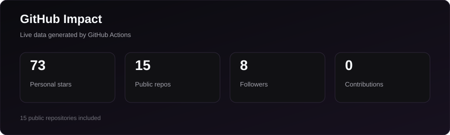
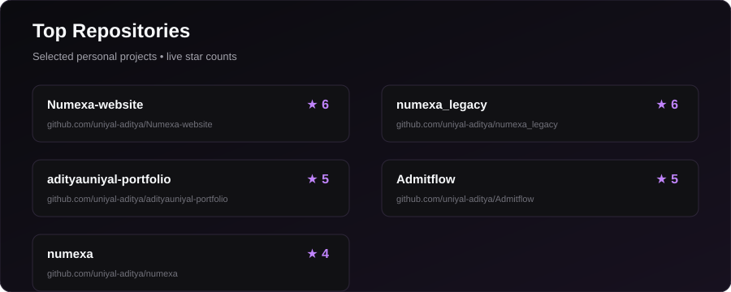
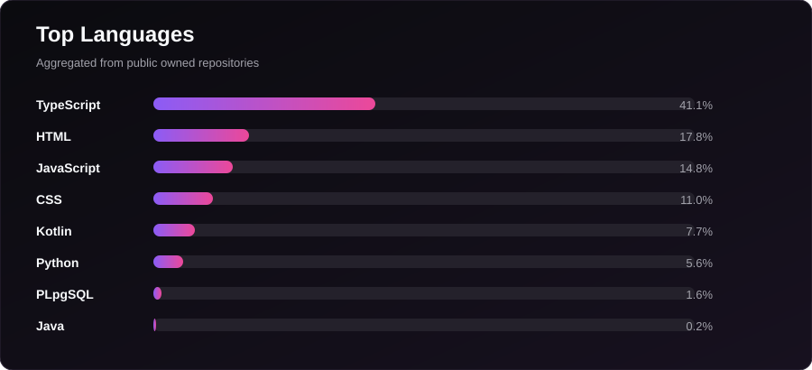
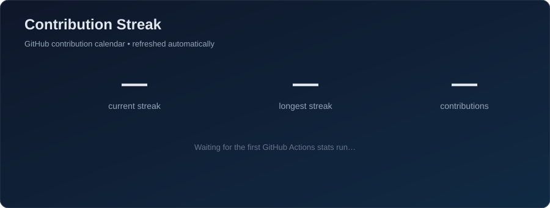

 

 

> 1st-year CSE student turning cloud badges and late-night builds into an actual portfolio. Currently building **Enroute** for SIH 2026 — a logistics and accessibility platform built with FastAPI + React.

 

## ⚡ Snapshot

<table>
<tr>

<td align="center" width="25%">

<strong>🔥 Streak</strong>
 
live stats below

</td>

<td align="center" width="25%">

<strong>🏅 Certifications</strong>
 
<strong>4</strong>
 
Google · Microsoft

</td>

<td align="center" width="25%">

<strong>🧩 DSA</strong>
 
<strong>0 / 150</strong>
 
2026 goal

</td>

<td align="center" width="25%">

<strong>☁️ Cloud Arcade</strong>
 
chasing Trooper tier

</td>

</tr>
</table>

 

## ⭐ GitHub Impact

  

### 🏆 Top Repositories

 

## 🧭 The Path So Far

<b>🟣 Now — Building & Shipping</b>

 

- Building **Enroute** for SIH 2026
- Working through Google's **GEAR** (Gemini Enterprise Agent Ready) program
- Learning **C** as part of coursework

<b>✅ Earlier in 2026 — Getting Started</b>

 

- Started B.Tech CSE at **Doon University**
- Earned **2 Google Cloud badges** on Day 1 of learning
- Completed **Introduction to AI Agents** and **Agent Fundamentals** from Google Cloud
- Joined **Microsoft AI Skills Yatra**

<b>🎯 Next — What I'm Chasing</b>

 

- Land a first tech **internship** before 2nd year ends
- Solve **150+ problems** on LeetCode
- Ship an AI-powered project using the **Gemini API**
- Earn **Azure AI Fundamentals (AI-900)**

 

## 🛠️ Stack

<b>Languages</b>

 

<b>Cloud & AI</b>

 

<b>Tools & Platforms</b>

 

 

## 🌐 Active Programs

| Program | Status |
|---|:---:|
| Google GEAR | 🟢 |
| Google Cloud Arcade S1 2026 | 🟢 |
| Microsoft AI Skills Yatra | 🟢 |

 

## 📊 GitHub Stats

  

 

## 🤝 Reach Me

  

